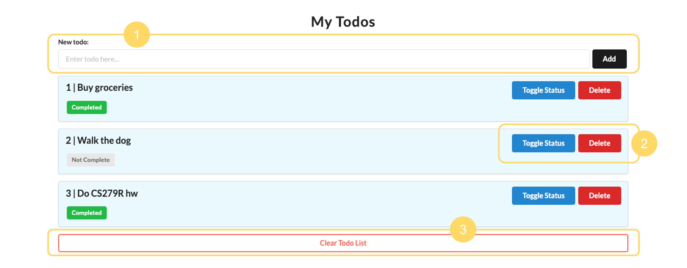

# todo6
Todo app made with Flask: [https://cyeh-todo-flask.herokuapp.com/](https://cyeh-todo-flask.herokuapp.com/)

## instructions
Open [webpage](https://cyeh-todo-flask.herokuapp.com/) to start exploring. The app comes preloaded with a few todo items as an example.

*Try these features out!*
1. **Add** a new todo by typing into the input & pressing the "Add" button to add it to the list
2. **Check/uncheck off** or **remove** a todo by clicking on the "Toggle Status"/"Delete" buttons to the right of each item
3. **Remove all** todos by pressing the "Clear Todos List" button at the bottom of the screen

## resources
I followed this [tutorial](https://www.python-engineer.com/posts/flask-todo-app/) to build my todo app with Flask, making modifications accordingly.
